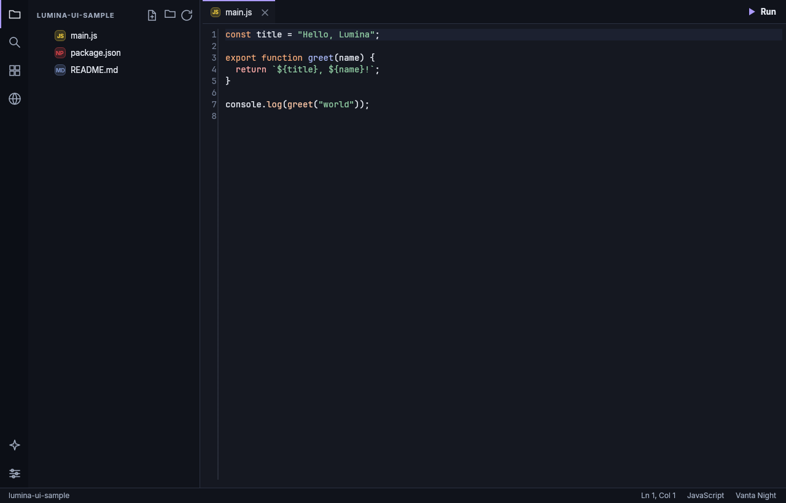
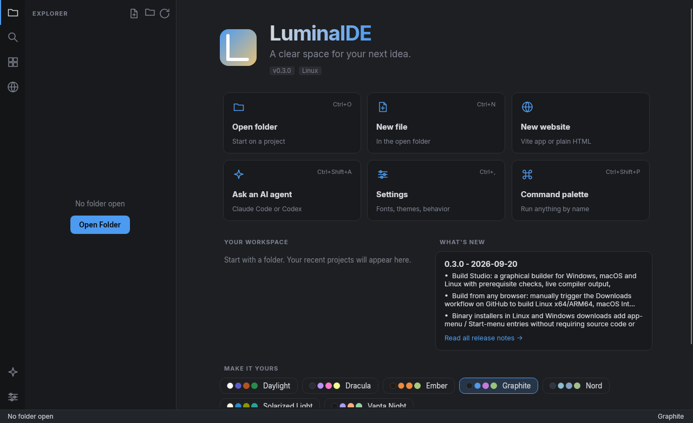
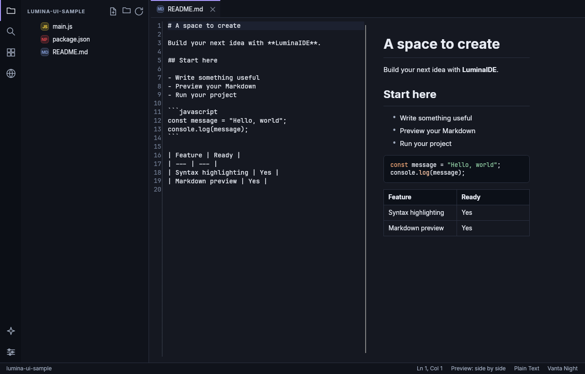
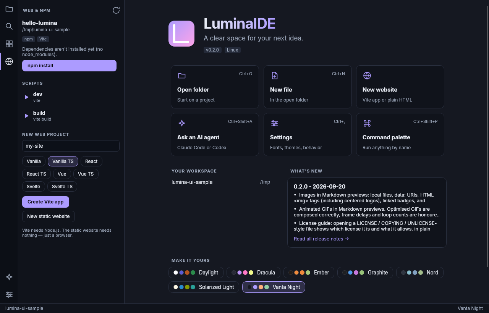
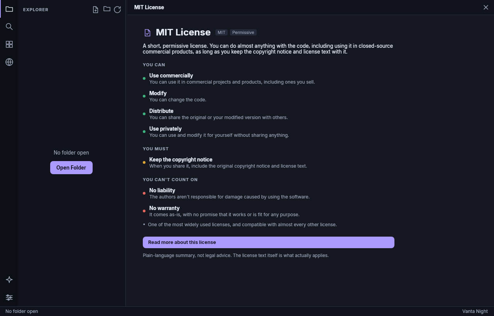
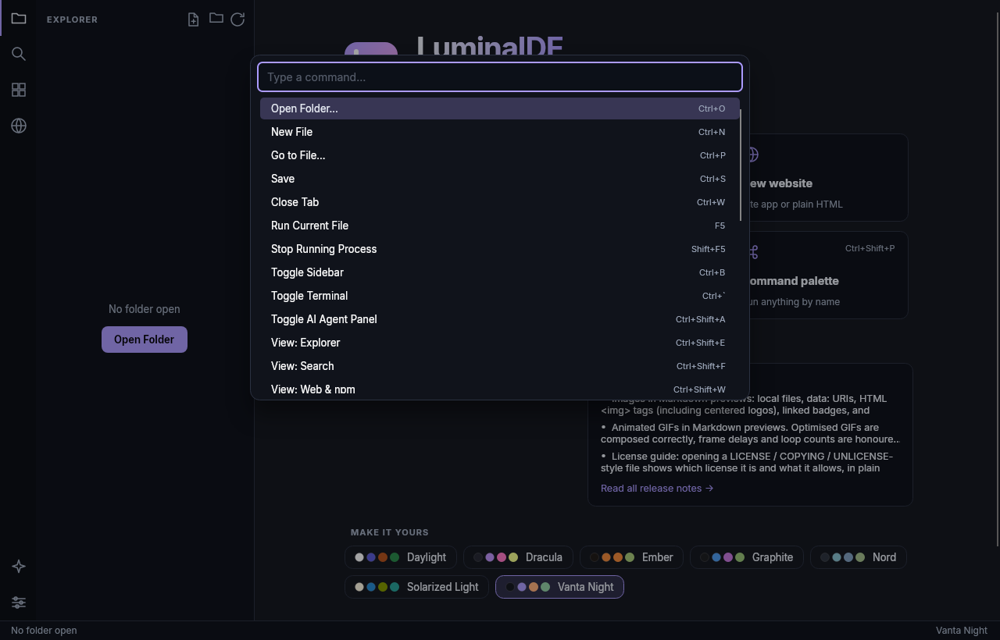
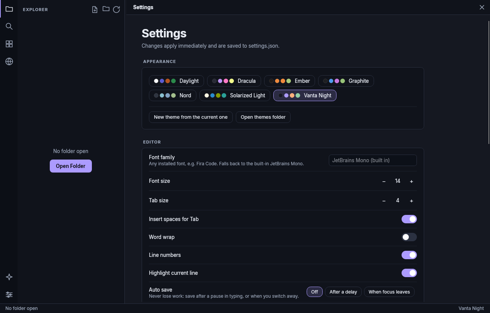
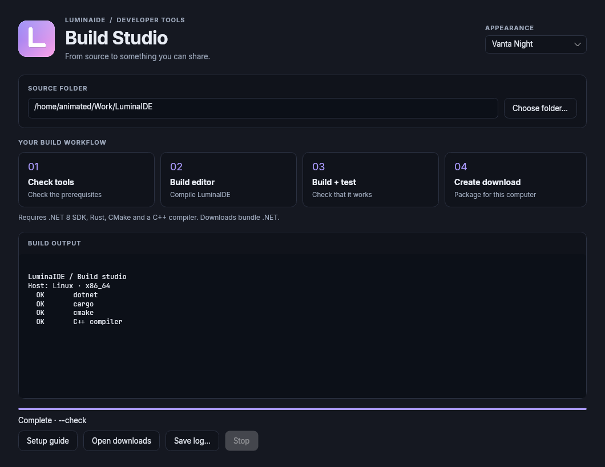

# LuminaIDE

**A small, fast code editor** for people who like the idea of VS Code but not the weight of it.
Tabs, 89 languages, a live Markdown preview, npm/Vite tools, an AI agent panel, real themes, and one plain
`settings.json`. Built with Rust, C++ and C# (Avalonia).

|  |  |
|--|--|
|  |  |
|  |  |
|  |  |

## Highlights

- **Looks**: bundled Inter and JetBrains Mono fonts, colour-coded file icons, and themes that are actually designed.
- **Editor**: tabs, find (Ctrl+F), fuzzy **quick open** (Ctrl+P), **command palette** (Ctrl+Shift+P), auto-save, zoom, per-file language override.
- **89 languages** highlighted out of the box — Nix, Haskell, OCaml, Elixir, Swift, Dart, PHP, Ruby, Zig, Kotlin, GLSL, Terraform, Dockerfile and many more
  ([full list](docs/LANGUAGES.md)). A language is one small JSON file.
- **Themes**: Vanta Night, Graphite, Daylight, Ember, Nord, Dracula, and Solarized Light.
  Make your own from Settings; saving a theme file updates it live ([docs](docs/THEMES.md)).
- **Web & npm panel**: finds `package.json`, detects the package manager and frameworks, runs scripts in one click, links to
  the Vite dev server, and can scaffold a Vite app or a plain static site.
- **Markdown preview** beside the editor: bold, italics, tables, task lists, quotes, highlighted code blocks and **images** —
  local files, `data:` images, `` tags, and `https://` images including **SVG badges** and **animated GIFs**.
- **License guide**: open a `LICENSE` file and LuminaIDE says which license it is and, in plain language, what it allows
  ([docs](docs/LICENSES.md)). 22 licenses (MIT, Apache, GPL family, MPL, BSD, CC0, OFL and more), extensible.
- **Run code with F5** in the built-in terminal (Python, Node, Rust, C/C++, Go, Java, Ruby, PHP, …); HTML opens in your browser.
- **AI agents**: chat with Claude Code or Codex about your project, using the CLIs you already have. Plan mode is read-only.
- **Settings page + `settings.json`**: every option documented ([docs](docs/CONFIG.md)); comments allowed; applied when you save.
- **Extensions**: a folder with an `extension.json` adds languages and themes.

## Install

Download a self-contained package from [Releases](https://github.com/AnimatedGTVR/LuminaIDE/releases/latest). No .NET installation is needed.

**[Download and build guide](docs/BUILDING.md)** · **[Build from any browser](https://github.com/AnimatedGTVR/LuminaIDE/actions/workflows/release.yml)**

For builds from a phone, tablet or another OS, fork the repository and choose **Actions → Downloads → Run workflow**. Download the finished platform artifact. The editor runs on desktop Windows, macOS and Linux.

| | Package | Then |
|--|--|--|
| **Linux** | `LuminaIDE-…-linux-x64.tar.gz` (or `arm64`) | Unpack and run `./LuminaIDE`. |
| **macOS** | `LuminaIDE-…-osx-arm64.zip` (Apple silicon) or `osx-x64` (Intel) | Unzip, drag `LuminaIDE.app` to Applications. It is not notarized yet: the first time, right-click → **Open**. |
| **Windows** | `LuminaIDE-…-win-x64.zip` | Unzip and run `LuminaIDE.exe`. SmartScreen may warn because the exe isn't signed yet. |

### Graphical builder

Install the .NET 8 SDK, then open **Build.cmd** (Windows), **Build.command** (macOS), or run **`./build.sh --gui`** (Linux). Build Studio checks your tools, builds, runs tests, and creates shareable downloads with a live log and stop button.

### From source

You need the [.NET 8 SDK](https://dotnet.microsoft.com/download), [Rust](https://rustup.rs), CMake and a C++17 compiler (Ninja is optional). See [platform setup](docs/BUILDING.md).

    ./build.sh --check         # check prerequisites
    ./build.sh package         # create a self-contained download + checksum in dist/
    ./build.sh                 # Linux / macOS: build everything
    ./build.sh run .           # build and open the current folder
    ./install.sh               # install `luminaide` + a launcher for your user (--uninstall to remove)

    .\build.ps1                # Windows: automatically locates Visual Studio Build Tools
    .\build.ps1 package        # create a self-contained Windows download
    .\install.ps1

After installing you can use it like any command:

    luminaide .                # open the current folder (returns immediately, like `code`)
    luminaide notes.md main.py # open files
    luminaide -f .             # stay attached to the terminal to see its output
    luminaide --selftest       # check that the native libraries and shell work on this machine
    luminaide --help

## Platform support

Be aware of what has and hasn't been exercised so far:

| Platform | Status |
|--|--|
| **Linux x64** | Developed and tested here: unit tests, self-test, UI checked by rendering screenshots. |
| **macOS** (Apple silicon / Intel) | Code paths for the terminal (`forkpty`), ⌘ shortcuts, app bundle are written; the app is a standard Avalonia app. **Not yet run on a Mac** — CI builds and self-tests it, please report problems. |
| **Windows** | The terminal is a new backend (`cmd.exe` on pipes, no ConPTY), path handling are written. **Not yet run on Windows** — CI builds and self-tests it, please report problems. |

The CI workflow (`.github/workflows/ci.yml`) builds, tests and self-tests all three, so a green check there is the real answer.
Known differences: on Windows the terminal doesn't echo what you type (the UI does it for you) and full-screen programs don't work.

## Keyboard shortcuts

On macOS, read **Ctrl** as **⌘** (except for the terminal toggle, which stays Ctrl+\`).

| Key | Action |
|--|--|
| Ctrl+P / Ctrl+Shift+P | Quick open a file / command palette |
| Ctrl+O, Ctrl+N, Ctrl+S, Ctrl+W | Open folder, new file, save, close tab |
| Ctrl+F | Find in the file |
| F5 / Shift+F5 | Run the current file / stop it |
| Ctrl+B | Toggle sidebar |
| Ctrl+Shift+E / F / W / X | Explorer / Search / Web & npm / Extensions |
| Ctrl+\` | Terminal |
| Ctrl+Shift+A | AI agent panel |
| Ctrl+Shift+V | Markdown preview layout |
| Ctrl+, | Settings |
| Ctrl + / Ctrl − / Ctrl 0 | Editor zoom |

## Configuration and customization

- **Settings**: Ctrl+, or edit `settings.json` — see [docs/CONFIG.md](docs/CONFIG.md).
- **Themes**: [docs/THEMES.md](docs/THEMES.md), seven opaque themes and custom colour palettes.
- **Languages and extensions**: [docs/LANGUAGES.md](docs/LANGUAGES.md).

## AI agent panel

Ctrl+Shift+A opens a chat that runs the **Claude Code** or **Codex** CLI inside your open folder and streams what it does:

| | Claude Code | Codex |
|--|--|--|
| Command | `claude -p --output-format stream-json …` | `codex exec --json …` |
| Plan · read-only | `--permission-mode plan` | `--sandbox read-only` |
| Edit files | `--permission-mode acceptEdits` | `--sandbox workspace-write` |

LuminaIDE stores no keys and makes no API calls itself; sign in with the CLI first. **Plan · read-only is the default.** When
a turn ends, open tabs whose files changed are reloaded (tabs with unsaved edits are never overwritten). Codex support follows its
documented event format but hasn't been run against a live Codex CLI yet.

## Known limitations

- Highlighting is lexical (comments, strings, numbers, keywords and some structure), not a full grammar or language server.
- The terminal is line-based (`TERM=dumb`, ANSI stripped): fine for commands and scripts, not for vim/htop.
- The Markdown preview doesn't scroll in sync with the editor, shows only the `` tags of raw HTML, and has no footnotes. GIFs are held in memory (96 MB cap); a larger one shows its first frame.
- Remote Markdown images are downloaded (https only, 15 MB cap, cached). That contacts the image host, so there is a setting to turn it off (`markdownRemoteImages`).
- Agent replies are plain text.

## Contributing

See [CONTRIBUTING.md](CONTRIBUTING.md). The release process is in [docs/RELEASING.md](docs/RELEASING.md); release notes are in [CHANGELOG.md](CHANGELOG.md).

## License

MIT — see [LICENSE](LICENSE). Third-party notices are in [NOTICE](NOTICE).
